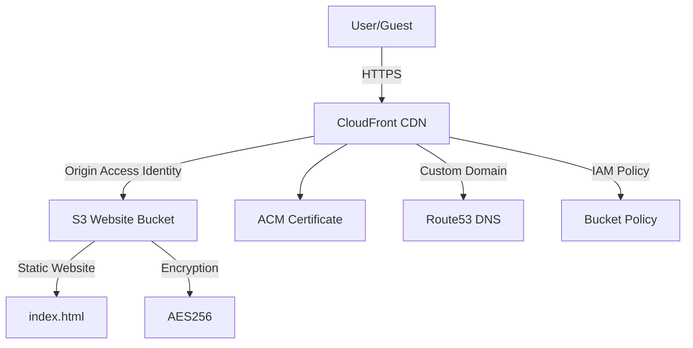

# Cozy Home Away LLC Static Website

**Live site: [cozyhomeaway.com](https://cozyhomeaway.com)**

Welcome to the source code for the Cozy Home Away LLC static website. This site is designed to showcase our family-friendly vacation rental and provide guests with a seamless booking experience.

## Features
- Modern, responsive design
- Highlights our featured vacation home
- Easy booking and contact options
- Hosted on AWS S3 and CloudFront for fast, secure delivery

## Project Structure
```
assets/
  css/         # Stylesheets
  js/          # JavaScript files
  images/      # Site images and logo
  sass/        # SASS source files
index.html     # Main website file
config/        # CloudFormation and deployment configs
.github/       # GitHub Actions workflows
```

## Deployment
Production deployments are managed via AWS CloudFormation and GitHub Actions. See `.github/workflows/deploy-prod.yml` and `config/prod-stack.yaml` for details.

## Automated Review Updates
A scheduled GitHub Actions workflow (`.github/workflows/update-reviews.yml`) runs daily at noon UTC. It uses Playwright to scrape new reviews from Airbnb and VRBO, appends any new reviews to `src/reviews.html`, and commits the change to `main`. That commit automatically triggers `deploy-prod.yml`, so new reviews go live without manual intervention.

## Getting Started
1. Clone this repository.
2. Make changes to `index.html` or assets as needed.
3. Push to the `main` branch to trigger deployment (requires AWS credentials in repo secrets).

## Architecture Diagram



---
© Cozy Home Away LLC. All rights reserved.
